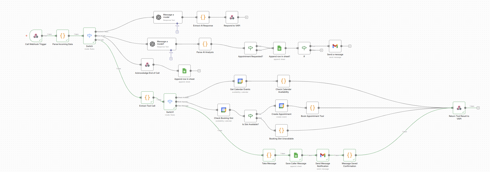
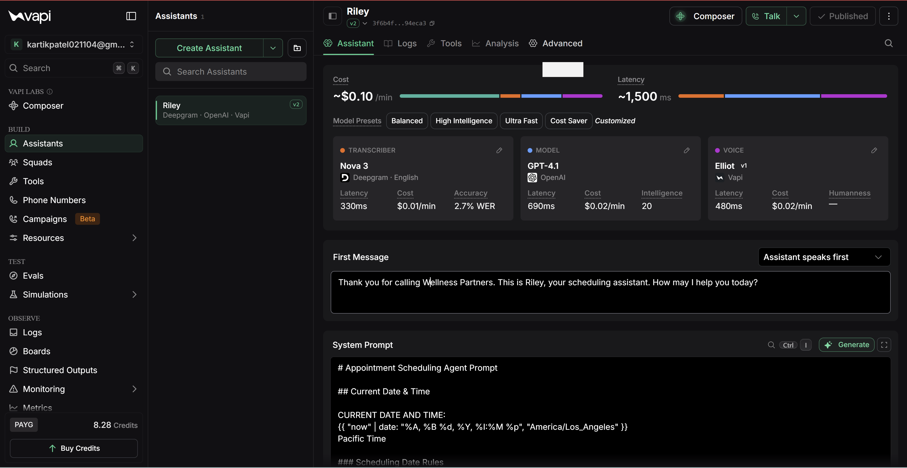
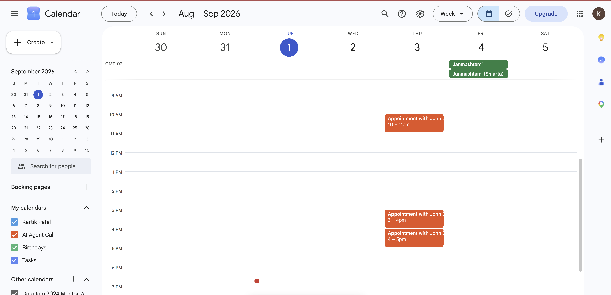
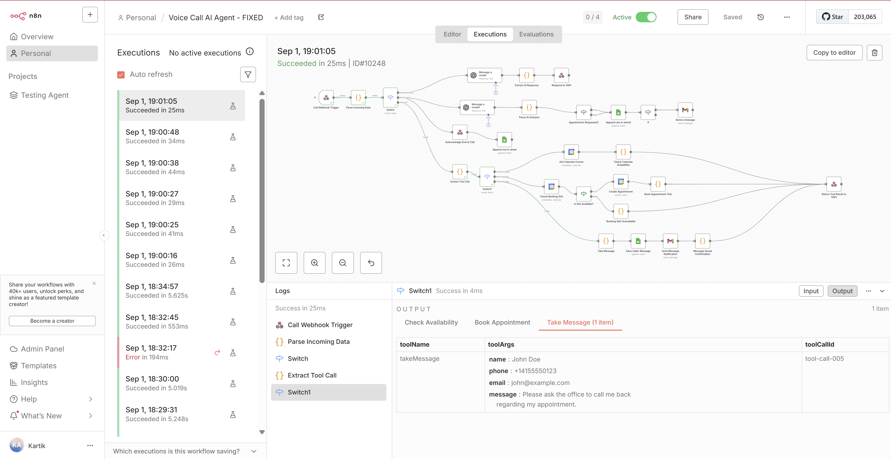

# AI Voice Appointment Scheduling Agent

An AI-powered voice agent that handles phone conversations, checks real-time appointment availability, books appointments, prevents double booking, records caller messages, and automates follow-up workflows.

The project combines **Vapi, n8n, OpenAI, Google Calendar, Google Sheets, Gmail, Webhooks, and JavaScript**.

## Features

- AI-powered voice conversations
- Real-time Google Calendar availability checking
- Automatic appointment scheduling
- Double-booking prevention
- Caller message capture
- Google Sheets call logging
- Gmail notifications
- End-of-call AI analysis
- Urgency and sentiment detection
- Vapi tool calling through n8n webhooks

## Project Demonstration

### Complete n8n Workflow

The complete workflow orchestrates Vapi voice calls, OpenAI processing, calendar scheduling, message handling, and automated notifications.



### Vapi AI Voice Assistant

The Vapi assistant handles real-time voice conversations and communicates with the n8n workflow through webhook-based tool calls.



### Calendar Availability & Appointment Booking

The agent checks Google Calendar availability before creating an appointment, preventing duplicate bookings.



### Caller Message Automation

When a caller leaves a message, the workflow records the information, saves it to Google Sheets, sends an email notification, and returns confirmation to the caller.



## Workflow Architecture

```text
Caller
   ↓
Vapi Voice Assistant
   ↓
n8n Webhook
   ↓
Message Router
   │
   ├── Assistant Request
   │      ↓
   │   OpenAI
   │      ↓
   │   Response to Vapi
   │
   ├── End-of-Call Report
   │      ↓
   │   AI Analysis
   │      ↓
   │   Google Sheets
   │      ↓
   │   Urgency Detection
   │      ↓
   │   Gmail Alert
   │
   └── Tool Calls
          │
          ├── Check Availability
          │      ↓
          │   Google Calendar
          │
          ├── Book Appointment
          │      ↓
          │   Check Calendar Slot
          │      ↓
          │   Prevent Double Booking
          │      ↓
          │   Create Appointment
          │
          └── Take Message
                 ↓
              Google Sheets
                 ↓
              Gmail Notification
```
# Tools & Technologies
- n8n
- Vapi
- OpenAI
- Google Calendar API
- Google Sheets
- Gmail
- JavaScript
- JSON
- REST APIs
- Webhooks
- Postman

# Appointment Scheduling

Before an appointment is created, the workflow checks Google Calendar for the requested date and time.

If the slot is available:

```
Check Booking Slot
        ↓
Is Slot Available?
        ↓ TRUE
Create Appointment
        ↓
Return Confirmation to Vapi
```

If the slot is already occupied:

```
Check Booking Slot
        ↓
Is Slot Available?
        ↓ FALSE
Booking Slot Unavailable
        ↓
Ask Caller to Select Another Time
```

This prevents duplicate appointments.

# Take Message Automation

When a caller wants to leave a message:

Take Message
     ↓
Save Caller Message
     ↓
Google Sheets
     ↓
Gmail Notification
     ↓
Confirmation to Caller

# Setup
Download the workflow JSON.
Import it into n8n.
Configure your own OpenAI credentials.
Connect Google Calendar.
Connect Google Sheets.
Connect Gmail.
Configure your Vapi assistant.
Connect the Vapi webhook to n8n.
Activate the workflow.
Test the agent.

# Security

Sensitive information has been removed from the public workflow.

The repository does not intentionally include:

API keys
Authentication tokens
OAuth credentials
Passwords
Private Google resource IDs
Production webhook IDs

Users must connect their own credentials after importing the workflow.

# Workflow File

The cleaned n8n workflow is available here:

Voice_Call_AI_Agent.json
